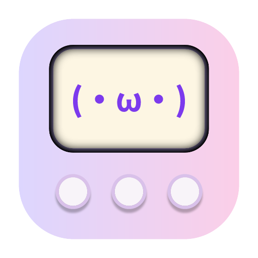

<p align="center">
  
</p>

<h1 align="center">Clock Lock</h1>

<p align="center">
  <strong>An AI-powered workspace companion for personal developers.</strong><br />
  Project knowledge base, AI agent chat, and emotional-support supervision —<br />
  in a minimal, non-IDE desktop interface.
</p>

<p align="center">
  <a href="LICENSE"></a>
  <a href="https://v2.tauri.app/"></a>
  <a href="https://vuejs.org/"></a>
  <a href="https://www.rust-lang.org/"></a>
</p>

---

## What is Clock Lock?

Clock Lock is a **desktop companion app** that helps solo developers stay organized, focused, and motivated. It combines three core tools into one lightweight window:

- **📋 Project Knowledge Base** — A structured `home.md` file with dedicated sections for Overview, Todos, and Notes. Edit with a custom section-based Markdown editor.
- **🤖 AI Agent Chat** — Talk through problems with an AI that has native tool calling, context awareness, and the ability to directly update your project knowledge base.
- **🐱 Supervision & Companionship** — Idle detection with friendly check-ins, a reactive Tamagotchi-style pet, and OS-native notifications to keep you on track.

All wrapped in a **transparent, frameless Tauri window** that stays out of your way — and shrinks to a compact 260×140 widget for low-profile monitoring.

---

## Features

### Structured Project Knowledge Base (`home.md`)

- **Three-Pillar Architecture** — `home.md` is managed as a structured document with three dedicated sections:
  - **Overview** — A high-level project description and tech stack summary.
  - **Todos** — A checklist of user-owned micro-tasks.
  - **Notes** — A running log of observations, research, and decisions.
- **Section-Based Editor** — The center panel features a specialized editor for `home.md` with dedicated UI for each section. Overview and Notes support rich Markdown editing; Todos feature a native interactive checklist with drag-to-reorder (planned) and one-click completion.
- **Live Sync & Locking** — Changes are synchronized via a file-system watcher. The editor detects external changes and merges them safely, ensuring the agent and user stay in sync.

### Evolved AI Agent Intelligence

- **Native Tool Calling** — High-reliability interaction using OpenAI/Anthropic-compatible function calling. No more fragile regex parsing.
- **Internal Monologue** — The agent's reasoning is rendered as a collapsible "thought process" block, providing transparency into its plan before it executes tools.
- **Surgical Updates** — The agent uses dedicated tools (`update_overview`, `add_todo`, `append_notes`) to modify the project knowledge base without overwriting your manual edits.
- **Context Awareness** — Automatically pulls relevant context (git status, file structure, recent activity) into the system prompt.
- **Build Failure Awareness** — Proactively offers help and diagnostic steps when a suggested shell command returns an error.
- **Slash Commands** — `/status`, `/remind`, `/review`, `/scan`, `/summarize`, `/focus`, and `/help`. `/scan` performs a deep dive into the project to initialize the Overview and first Todos.

### Memory & Workspace Locking

- **Conversation Persistence** — SQLite-backed session history with full-text search (FTS5).
- **Workspace-Locked Shell** — A sandboxed bash/powershell environment locked to the project root with safety checks for dangerous commands.
- **Cold Start Recovery** — Remembers your last active file and task state, providing a personalized welcome-back message after inactivity.

### Supervision & Companionship

- **Idle Detection** — If no activity for a configurable threshold, the companion sends a friendly check-in. Falls back to a local message if no AI API is configured.
- **Tamagotchi Pet** — A 5-state kaomoji face (idle/thinking/happy/sleepy/excited) with per-state CSS animations, driven by filesystem activity and agent responses.
- **OS Notifications** — Critical check-ins and task reminders delivered via system-native notifications.

### Widget Mode

- **Compact Overlay** — Shrinks to a 260×140 always-on-top window for low-profile monitoring.
- **Rich Rendering** — Agent messages are rendered with Markdown support even in the compact view.
- **Task Tracking** — Displays the top pending task from your `home.md` directly in the widget.

---

## Tech Stack

| Layer              | Stack                                                        |
| ------------------ | ------------------------------------------------------------ |
| **Desktop shell**  | [Tauri v2](https://v2.tauri.app/)                            |
| **Frontend**       | Vue 3 (Composition API), Pinia, TypeScript                   |
| **Backend**        | Rust — `git2`, `notify`, `sqlx` + SQLite, `reqwest`          |
| **Markdown**       | `marked` (rendering), `shiki` (syntax highlighting)           |

---

## Architecture

```
┌─────────────────────────────────────────────────────────┐
│                    Frontend (Vue 3)                     │
│  AppLayout (3-panel resizable)                          │
│    ├── FileTree (Git-aware browser)                    │
│    ├── WorkspaceHome → MarkdownEditor (Section-based)   │
│    └── AgentChat (Streaming, Thought Blocks, Tools)     │
│                                                         │
│  WidgetWindow (Compact overlay with Pet & Quick Input)  │
│                                                         │
│  Pinia: workspace (HomeData) · agent (Session) · sv     │
├─────────────────────────────────────────────────────────┤
│                  Backend (Rust / Tauri)                 │
│  commands/fs.rs     — Structured home.md (read/save)    │
│  commands/agent.rs  — LLM streaming & tool execution    │
│  commands/shell.rs  — Workspace-locked sandboxed shell   │
│  commands/memory.rs — SQLite CRUD + FTS5 search         │
│  watcher.rs         — FS watcher (emits home-md-changed)│
│  supervision.rs     — Idle detection background task    │
└─────────────────────────────────────────────────────────┘
```

---

## Getting Started

```bash
# Install dependencies
npm install

# Run in development mode
npm run tauri dev

# Type-check & lint
npx vue-tsc --noEmit
cd src-tauri && cargo clippy
```

### Prerequisites

- **Node.js** ≥ 18
- **Rust** (latest stable; install via [rustup](https://rustup.rs/))
- **System dependencies** (Linux):
  ```bash
  sudo apt install libwebkit2gtk-4.1-dev libappindicator3-dev \
    librsvg2-dev libgtk-3-dev libjavascriptcoregtk-4.1-dev \
    libsoup-3.0-dev
  ```

---

## License

[GNU Affero General Public License v3.0](LICENSE) © 2025 Clock Lock contributors.

See [LICENSE](LICENSE) for the full text.
